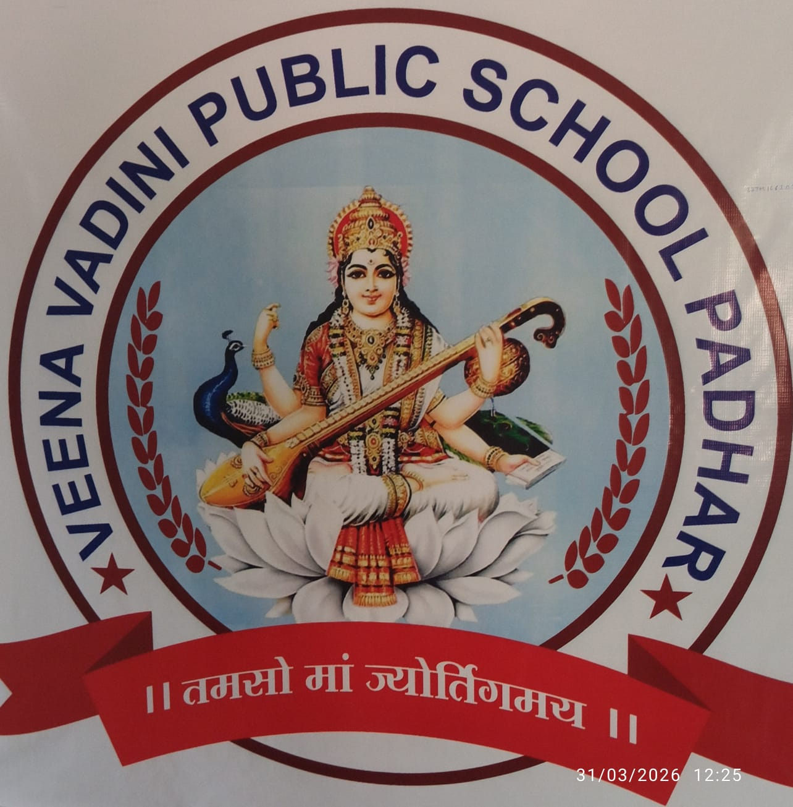

<p align="center">
  
</p>

<h1 align="center">Veena Vadini Public School</h1>

<p align="center">
  <strong>Empowering Young Minds for a Brighter Tomorrow.</strong><br/>
  Dream. Believe. Achieve.
</p>

<p align="center">
  <a href="https://veena-vadini-scl.vercel.app">
    
  </a>
</p>

<p align="center">
  <a href="https://veena-vadini-scl.vercel.app">🌐 Open Live Website</a>
  &nbsp;•&nbsp;
  <a href="https://veena-vadini-scl.vercel.app/admin/login">🔐 Admin Login</a>
</p>

---

## About the project

This repository contains the official premium website and content-management platform for **Veena Vadini Public School**, located at **Chhuri Road, Padhar, District Betul, Madhya Pradesh**.

The website is designed as a modern, highly responsive educational experience while preserving the school's identity across desktop, tablet and mobile devices. It combines an animated public website with a secure Supabase-backed administration workspace for managing school content.

### School information

- **School:** Veena Vadini Public School
- **Board:** CBSE Pattern
- **Medium:** Hindi & English
- **Classes:** Nursery to Class 8
- **Location:** Chhuri Road, Padhar, District Betul, Madhya Pradesh
- **Tagline:** Empowering Young Minds for a Brighter Tomorrow.
- **Motto:** Dream. Believe. Achieve.
- **WhatsApp:** +91 95758 51407

## Public website

The visitor-facing website includes:

- Premium animated homepage
- About School
- Principal & Leadership
- Academics
- Facilities
- Faculty
- Student Life
- Gallery
- Events
- Notices & Announcements
- Admissions
- Downloads
- Contact
- WhatsApp and Instagram integration
- Responsive mobile, tablet and desktop layouts
- SEO-ready metadata and structured school information

## Admin CMS

The protected Admin Panel is designed to manage normal website content without editing source code.

Administrators can manage:

- Homepage content
- About School
- Principal & Leadership
- Classes & Academics
- Facilities
- Faculty
- Gallery
- Events
- Notices
- Announcements
- Admission enquiries
- Contact enquiries
- Downloads
- Contact information
- Social media
- SEO settings
- Site settings

Content follows the intended flow:

**Admin Panel → Supabase → Public Website**

## Technology

- **Next.js 16**
- **React 19**
- **TypeScript**
- **Tailwind CSS**
- **Supabase / PostgreSQL**
- **Supabase Authentication**
- **Supabase Storage**
- **Row Level Security (RLS)**
- **Motion / GSAP**
- **Vercel deployment**

## Security

The project includes protected admin routes, server-side authorization checks, Supabase Row Level Security, private storage buckets, validated enquiry handlers and server-only service-role usage.

> Never commit passwords, service-role keys, API secrets or local environment files to this repository.

## Local development

Install dependencies and start the development server:

```bash
pnpm install
pnpm dev
```

Then open:

```text
http://localhost:3000
```

Admin login:

```text
http://localhost:3000/admin/login
```

## Environment configuration

Production and local environments use environment variables such as:

```dotenv
NEXT_PUBLIC_SITE_URL=
NEXT_PUBLIC_SUPABASE_URL=
NEXT_PUBLIC_SUPABASE_PUBLISHABLE_KEY=
SUPABASE_SERVICE_ROLE_KEY=
NEXT_SERVER_ACTIONS_ENCRYPTION_KEY=
```

Keep all private values outside source control.

## Quality checks

Before production changes:

```bash
pnpm lint
pnpm typecheck
pnpm build
```

## Deployment

The production branch is **`main`** and is connected to Vercel.

**Live:** https://veena-vadini-scl.vercel.app  
**Production:** Vercel · `main` branch

Changes pushed to the production branch can trigger a new Vercel deployment.

---

<p align="center">
  Developed and maintained by <strong>SATI Technologies</strong><br/>
  <a href="https://www.satitechnologies.com/">www.satitechnologies.com</a>
</p>
